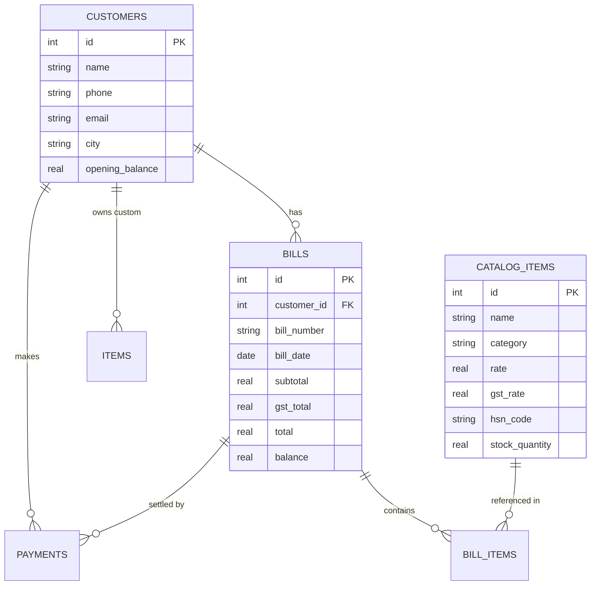

# BillMate — Local-First Billing & Inventory App

[](LICENSE)
[](https://sql.js.org/)
[](https://developer.mozilla.org/en-US/docs/Web/API/IndexedDB_API)
[](https://developer.mozilla.org/en-US/docs/Web/JavaScript/Guide/Modules)

**BillMate** is a privacy-focused, local-first web application for invoice generation, customer ledger management, inventory control, and payment tracking. Built with native WebAssembly SQLite (`sql.js`) and IndexedDB, all user data remains 100% private and stored locally inside the browser.

---

## 🌟 Key Features

* **🔒 100% Local-First & Private**: Powered by SQLite compiled to WebAssembly (`sql.js`). Database state automatically persists into browser IndexedDB after every transaction. No cloud server or external API required.
* **📊 Interactive Dashboard**: High-level metrics tracking total revenue, outstanding receivables, total payments collected, customer counts, and recent activity logs.
* **👥 Customer Management & Ledger**: Complete customer profiling (name, phone, email, address, city, opening balance) with detailed individual transaction history and running balances.
* **📦 Pre-seeded Parts & Inventory Catalog**: Includes 50+ built-in automotive spare parts, fluids, filters, sensors, and labor rates. Supports category classification, HSN codes, custom GST rates, stock levels, and min-stock alert thresholds.
* **🧾 Smart Invoice Builder**: Instant bill generation featuring catalog auto-complete, itemized pricing, GST tax calculations, optional carry-forward balances, custom notes, and printable invoice layouts.
* **💳 Payment Recording**: Support for multi-mode payments (Cash, UPI, Card, Net Banking, Cheque) linked to specific bills or general customer accounts with reference ID tracking.
* **📈 Reports & Analytics**: View customer balance summaries, collection reports, item sales breakdown, and export ledger data to CSV.
* **💾 Backup & Restore**: One-click JSON data export and import for seamless offline backups, data portability, and cross-device migration.

---

## 🛠️ Tech Stack

* **Frontend**: Native HTML5, Modern Vanilla CSS (Design Tokens, Custom Properties, Glassmorphism, Micro-animations)
* **Logic**: Vanilla JavaScript (ES6+ Modules, Async/Await, Web Component Architecture)
* **Database**: `sql.js` (WebAssembly SQLite runtime)
* **Persistence**: Browser `IndexedDB` API
* **Local Server**: Lightweight Python 3 (`http.server`) script with module MIME-type support

---

## 🚀 Getting Started

### Prerequisites
* Any modern Web Browser (Chrome, Firefox, Safari, Edge) with WebAssembly & IndexedDB support.
* **Python 3** (or any static HTTP file server).

> ⚠️ **Important**: Because the application uses ES6 JavaScript modules (`import`/`export`) and WebAssembly, it **must** be served via an HTTP/HTTPS web server, not directly opened via `file://`.

### Running Locally

1. **Clone the repository**:
   ```bash
   git clone https://github.com/PrabhekamSingh/bill-mate.git
   cd bill-mate
   ```

2. **Start the local development server**:
   ```bash
   python3 server.py
   ```

3. **Open the application**:
   Navigate to [http://localhost:8080](http://localhost:8080) in your browser.

---

## 📁 Directory Structure

```text
biller/
├── index.html           # Main SPA layout & HTML shell
├── server.py            # Local Python HTTP server (CORS & ES6 MIME types)
├── css/
│   ├── styles.css       # Core design tokens, global resets, typography & layout
│   └── components.css   # Styled UI components (tables, modals, buttons, forms, badges)
└── js/
    ├── app.js           # Main application entry point & router
    ├── db/
    │   ├── database.js  # SQLite WASM wrapper & IndexedDB persistence engine
    │   ├── schema.js    # Database tables schema & seed data (50+ catalog items)
    │   └── migrations.js# Database migration utilities
    ├── models/          # Data access models (Customer, Bill, Item, CatalogItem, Payment)
    ├── views/           # UI Views (Dashboard, Customers, Catalog, Payments, Reports, Settings)
    ├── components/      # Reusable UI controls (Form, Modal, Table, Toast)
    └── utils/           # Utilities (Currency formatter, Date utils, Export engine, Validation)
```

---

## 🗄️ Database Schema & Storage Architecture

BillMate maintains relational integrity using an in-memory SQLite database instance loaded into the browser via WebAssembly:



* **Auto-Save Mechanism**: Every database write (`INSERT`, `UPDATE`, `DELETE`, or `transaction`) automatically exports the SQLite binary buffer into IndexedDB (`billing_app_db`).
* **Auto-Restore**: Upon loading the application, `database.js` inspects IndexedDB for existing data and reloads the binary SQLite state instantly.

---

## 📄 License

This project is open-source and available under the [MIT License](LICENSE).
